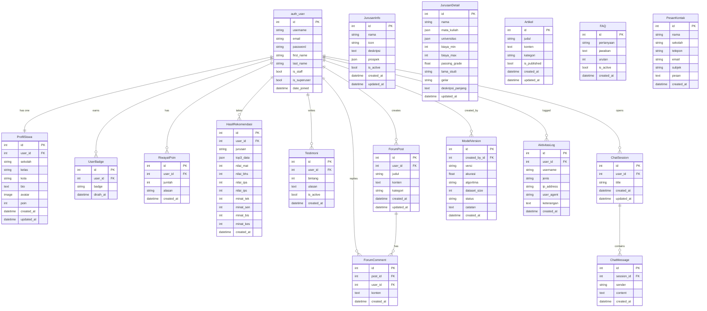
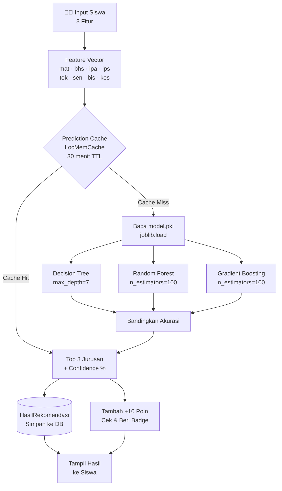

# 🎓 JurusanKu ID — Platform Rekomendasi Jurusan Berbasis Machine Learning

[](https://python.org)
[](https://djangoproject.com)
[](https://scikit-learn.org)
[](https://sqlite.org)
[](LICENSE)

> **JurusanKu ID** adalah platform web interaktif untuk membantu siswa SMA/SMK menentukan jurusan kuliah terbaik menggunakan Machine Learning, Gamifikasi, Forum Diskusi, dan AI Career Mentor.

---

## 📋 Daftar Isi

- [Tentang Proyek](#-tentang-proyek)
- [Fitur Utama](#-fitur-utama)
- [Teknologi yang Digunakan](#-teknologi-yang-digunakan)
- [Skema Database](#-skema-database)
- [Arsitektur ML Pipeline](#-arsitektur-ml-pipeline)
- [Struktur Direktori](#-struktur-direktori-proyek)
- [Panduan Instalasi](#-panduan-instalasi--menjalankan-lokal)
- [Panduan Retraining Model ML](#-panduan-pelatihan-ulang-model-ml)
- [Fitur Keamanan](#-fitur-keamanan-detail)
- [Menjalankan Tests](#-menjalankan-tests)
- [Kontribusi](#-kontribusi)
- [Lisensi](#-lisensi)

---

## 🌐 Tentang Proyek

**JurusanKu ID** adalah platform web interaktif berbasis Django yang dirancang untuk membantu siswa SMA/SMK/Sederajat menentukan jurusan kuliah yang paling sesuai dengan potensi akademik dan minat mereka.

Sistem ini menggunakan seleksi otomatis model terbaik dari tiga algoritma — **Decision Tree**, **Random Forest**, dan **Gradient Boosting** — untuk menganalisis nilai mata pelajaran serta kecenderungan minat siswa, lalu memberikan rekomendasi **Top 3 Jurusan Kuliah** secara akurat dan personal.

### 🎯 Masalah yang Diselesaikan

Banyak siswa SMA/SMK bingung memilih jurusan kuliah. JurusanKu ID hadir sebagai solusi *data-driven* yang:

- Menganalisis profil akademik & minat siswa secara objektif
- Memberikan rekomendasi berbasis data, bukan sekadar opini
- Membangun komunitas belajar untuk berbagi pengalaman
- Menyediakan informasi detail setiap jurusan secara terstruktur

---

## 🌟 Fitur Utama

### 1. 🤖 Rekomendasi Jurusan Berbasis ML (Multi-Algorithm)

- Menganalisis **4 nilai mata pelajaran utama**: Matematika, Bahasa, IPA, IPS (skala 0–100)
- Menganalisis **4 metrik minat siswa**: Teknologi, Seni, Bisnis, Kesehatan (skala 1–5)
- **Auto-select model terbaik** dari tiga algoritma: Decision Tree, Random Forest, Gradient Boosting
- Menghasilkan **Top 3 Jurusan Rekomendasi** dengan persentase kecocokan yang terkalibrasi
- **Caching prediksi** otomatis 30 menit untuk efisiensi performa
- Fitur **Cetak Hasil** (print-friendly) untuk mengunduh atau mencetak laporan

### 2. 🎮 Sistem Gamifikasi & Poin

- **Sistem Poin**: Diperoleh dari aktivitas — tes rekomendasi, baca artikel, lengkapi profil, jelajahi jurusan

| Badge | Ikon | Kondisi |
|---|---|---|
| Pemula | 🧪 | Melakukan tes pertama |
| Rajin Tes | 🔁 | Aktif melakukan tes |
| Expert | 🏆 | Pencapaian tertinggi |
| Profil Lengkap | 📋 | Mengisi semua data profil |
| Poin 100 | ⭐ | Mengumpulkan 100 poin |
| Pembaca | 📰 | Aktif membaca artikel |
| Penjelajah | 🔍 | Menjelajahi banyak jurusan |

### 3. 💬 Forum Diskusi Interaktif

- Komunitas diskusi topik UTBK, kehidupan kampus, karir, dan umum
- Sistem komentar bersarang
- Kategori forum: **Jurusan**, **UTBK**, **Karir**, **Umum**

### 4. 🤖 AI Career Mentor (Chat)

- Sesi percakapan dengan AI Career Mentor secara interaktif
- Riwayat sesi tersimpan dan dapat dilanjutkan
- Panduan karir, saran jurusan, dan tips UTBK secara personal

### 5. 📈 Panel Admin Komprehensif

- Grafik analitik sebaran rekomendasi, rata-rata nilai, dan aktivitas terbaru
- CRUD Konten: Jurusan, Artikel, FAQ, Testimoni
- Manajemen versi model ML (akurasi, algoritma, dataset size)
- Log keamanan dan monitor aktivitas mencurigakan

### 6. 🛡️ Keamanan & Security Logging

- **Math CAPTCHA** dinamis pada login & register (anti-bot/brute-force)
- **Rate Limiting** berbasis Django Cache (tanpa Redis):

| Endpoint | Batas | Window |
|---|---|---|
| `/predict/` | 15 request | 60 detik |
| `/login/` | 5 request | 60 detik |
| `/register/` | 3 request | 60 detik |
| `/api/*` | 60 request | 60 detik |

- **Session Timeout** otomatis 30 menit idle
- **Activity Logging** otomatis ke database

### 7. 🎨 UI/UX Premium & Responsif

- Dark mode elegan dengan efek *glassmorphism*
- Animasi jaringan saraf 3D (*neural network*) menggunakan **Three.js (WebGL)**
- Buffer geometri dinamis untuk performa tanpa lag
- Fully responsive: mobile, tablet, dan desktop

---

## 🛠️ Teknologi yang Digunakan

| Kategori | Teknologi | Versi |
|---|---|---|
| Backend Framework | Django | 6.0.6 |
| Bahasa Pemrograman | Python | 3.10+ |
| ML — Classifier | scikit-learn (Decision Tree, Random Forest, Gradient Boosting) | 1.9.0 |
| ML — Numerik | NumPy | 2.4.6 |
| ML — Data | Pandas | 3.0.3 |
| ML — Serialization | Joblib | 1.5.3 |
| Database | SQLite | default Django |
| Aset Statis | WhiteNoise | latest |
| Frontend | HTML5, CSS3, JavaScript ES6+ | — |
| Animasi 3D | Three.js | r128+ |
| Image Processing | Pillow | latest |

---

## 🗄️ Skema Database

Proyek menggunakan **Django ORM** dengan SQLite. Terdapat **17 tabel** yang dikelompokkan menjadi 6 domain:



### Ringkasan Tabel

| Tabel | Domain | Keterangan |
|---|---|---|
| `auth_user` | Auth | User bawaan Django (otentikasi) |
| `ProfilSiswa` | Profil | Ekstensi profil siswa — OneToOne dengan User |
| `UserBadge` | Gamifikasi | Lencana pencapaian per user |
| `RiwayatPoin` | Gamifikasi | Log setiap penambahan poin |
| `HasilRekomendasi` | Rekomendasi | Rekaman tiap sesi tes rekomendasi |
| `JurusanInfo` | Jurusan | Master data jurusan (icon, deskripsi, prospek) |
| `JurusanDetail` | Jurusan | Detail jurusan (kurikulum, universitas, biaya) |
| `Artikel` | Konten | Artikel edukasi dikelola admin |
| `FAQ` | Konten | Pertanyaan yang sering diajukan |
| `Testimoni` | Konten | Ulasan dan rating dari siswa |
| `ForumPost` | Forum | Postingan diskusi di forum komunitas |
| `ForumComment` | Forum | Komentar/balasan pada postingan |
| `ChatSession` | AI Chat | Sesi percakapan dengan AI Career Mentor |
| `ChatMessage` | AI Chat | Pesan individual dalam sesi chat |
| `ModelVersion` | Admin | Riwayat versi model ML yang dilatih |
| `AktivitasLog` | Keamanan | Log aktivitas mencurigakan/penting |
| `PesanKontak` | Konten | Pesan dari formulir "Hubungi Kami" |

---

## 🤖 Arsitektur ML Pipeline



---

## 📂 Struktur Direktori Proyek

```text
jurusan-rekomendasi/
│
├── config/                       # Konfigurasi utama proyek Django
│   ├── settings.py               # Pengaturan aplikasi (DB, middleware, installed apps)
│   ├── urls.py                   # Routing URL utama
│   ├── wsgi.py                   # WSGI entry point (production)
│   └── asgi.py                   # ASGI entry point (async)
│
├── rekomendasi/                  # Aplikasi Django utama
│   ├── models.py                 # Definisi semua model database (17 model)
│   ├── views.py                  # Logika bisnis & controller semua halaman
│   ├── admin.py                  # Konfigurasi Django Admin panel
│   ├── security.py               # CAPTCHA, Rate Limiting, Activity Logging, Cache
│   ├── middleware.py             # Custom middleware: Rate Limit & Session Timeout
│   ├── apps.py                   # Konfigurasi aplikasi Django
│   ├── tests.py                  # Unit & integration tests
│   └── migrations/               # File migrasi database
│
├── ml_model/                     # Komponen Machine Learning
│   ├── dataset.csv               # Dataset pelatihan (separator: semicolon)
│   ├── train.py                  # Script pelatihan model dasar (Decision Tree)
│   ├── train_best.py             # Script auto-select model terbaik
│   ├── model.pkl                 # Model ML tersimpan (output joblib)
│   └── compare_models.ipynb      # Notebook perbandingan algoritma ML
│
├── templates/                    # Template HTML
│   ├── index.html                # Halaman beranda (Three.js neural network bg)
│   ├── login.html                # Halaman login + Math CAPTCHA
│   ├── register.html             # Halaman registrasi + Math CAPTCHA
│   ├── dashboard_user.html       # Dashboard siswa (hasil, poin, badge, forum)
│   ├── dashboard_admin.html      # Panel admin (analitik, CRUD, model, log)
│   └── print_hasil.html          # Template cetak hasil rekomendasi
│
├── static/                       # Berkas statis (CSS, JS, Gambar)
├── media/                        # Berkas unggahan pengguna (avatar)
│   └── avatars/
│
├── manage.py                     # Utilitas CLI Django
├── requirements.txt              # Daftar seluruh dependensi Python
├── .env                          # Variabel lingkungan (SECRET_KEY, DEBUG)
├── .gitignore                    # File yang diabaikan Git
└── README.md                     # Dokumentasi proyek ini
```

---

## 🚀 Panduan Instalasi & Menjalankan Lokal

### Prasyarat

Pastikan sudah terinstal di komputer Anda:
- **Python 3.10+** — [Download](https://python.org/downloads)
- **Git** — [Download](https://git-scm.com/downloads)

### Langkah 1 — Clone Repositori

```bash
git clone https://github.com/<username>/jurusan-rekomendasi.git
cd jurusan-rekomendasi
```

### Langkah 2 — Buat & Aktifkan Virtual Environment

```bash
python -m venv venv
```

**Windows (PowerShell):**
```powershell
.\venv\Scripts\Activate.ps1
```

**Windows (Command Prompt):**
```cmd
venv\Scripts\activate
```

**Linux / macOS:**
```bash
source venv/bin/activate
```

### Langkah 3 — Instal Dependensi

```bash
pip install -r requirements.txt
```

### Langkah 4 — Konfigurasi Environment

Buat file `.env` di direktori root (atau edit yang sudah ada):

```env
SECRET_KEY=your-super-secret-key-here
DEBUG=True
ALLOWED_HOSTS=127.0.0.1,localhost
```

### Langkah 5 — Migrasi Database

```bash
python manage.py migrate
```

### Langkah 6 — Buat Superuser Admin (Opsional)

```bash
python manage.py createsuperuser
```

### Langkah 7 — Jalankan Server

```bash
python manage.py runserver
```

Buka browser dan akses **http://127.0.0.1:8000/**

> Panel admin Django tersedia di **http://127.0.0.1:8000/admin/**

---

## 🧠 Panduan Pelatihan Ulang Model ML (Retraining)

### Opsi A — Auto-Select Model Terbaik (Direkomendasikan)

Script ini melatih tiga algoritma sekaligus dan otomatis memilih yang terbaik:

```bash
python ml_model/train_best.py
```

Contoh output:

```
Membaca dataset dari ml_model/dataset.csv
Ukuran training data: 700, testing data: 300
--------------------------------------------------
Akurasi Decision Tree: 97.33%
Akurasi Random Forest: 98.67%
Akurasi Gradient Boosting: 98.00%
--------------------------------------------------
Model terbaik terpilih: Random Forest (Akurasi: 98.67%)
Sukses mengekspor model terbaik ke ml_model/model.pkl
```

### Opsi B — Train Decision Tree Saja

```bash
python ml_model/train.py
```

### Format Dataset

Dataset menggunakan format **CSV dengan separator semicolon (`;`)**:

```csv
nilai_matematika;nilai_bahasa;nilai_ipa;nilai_ips;minat_teknologi;minat_seni;minat_bisnis;minat_kesehatan;jurusan
85;70;80;65;5;2;3;3;Teknik Informatika
70;80;65;75;2;4;3;2;Sastra
```

### Aturan Klasifikasi Label

| Kondisi | Label Jurusan |
|---|---|
| `matematika > 75` AND `minat_teknologi >= 4` | Teknik Informatika |
| `ipa > 75` AND `minat_kesehatan >= 4` | Kedokteran |
| `matematika > 70` AND `minat_bisnis >= 4` | Manajemen |
| `bahasa > 75` AND `minat_seni >= 4` | Sastra |
| `ips > 75` AND `minat_bisnis >= 3` | Akuntansi |
| `ipa > 70` | Biologi |
| *(default)* | Pendidikan |

---

## 🔒 Fitur Keamanan (Detail)

### Math CAPTCHA
- Soal matematika sederhana (penjumlahan/pengurangan, angka 1–15)
- Token unik per-sesi — **single-use** (otomatis dihapus setelah benar)
- Mencegah serangan bot dan brute-force

### Rate Limiting
- Bekerja dengan **Django `LocMemCache`** — tidak perlu Redis
- Blokir IP otomatis 60 detik setelah melampaui batas
- Semua kejadian dilog ke tabel `AktivitasLog`

### Session Timeout
- Auto-logout setelah **30 menit** tidak aktif
- Redirect ke halaman login dengan notifikasi
- Dicatat ke `AktivitasLog`

### Kategori Activity Log

| Kode | Ikon | Keterangan |
|---|---|---|
| `login_gagal` | 🔐 | Percobaan login yang gagal |
| `rate_limit` | 🚫 | IP melampaui batas request |
| `akses_ditolak` | ⛔ | Akses halaman tanpa izin |
| `captcha_gagal` | 🤖 | Jawaban CAPTCHA salah |
| `register_gagal` | 📝 | Registrasi akun gagal |
| `login_sukses` | ✅ | Login berhasil |
| `logout` | 🚪 | User logout |
| `session_timeout` | ⏱️ | Session habis karena idle |

---

## 🧪 Menjalankan Tests

```bash
python manage.py test rekomendasi
```

---

## 🤝 Kontribusi

Kontribusi sangat diterima! Langkah-langkah:

1. **Fork** repositori ini
2. Buat branch baru: `git checkout -b feature/nama-fitur`
3. Commit perubahan: `git commit -m 'feat: tambah fitur X'`
4. Push ke branch: `git push origin feature/nama-fitur`
5. Buka **Pull Request**

---

## 📄 Lisensi

Proyek ini dikembangkan untuk tujuan **edukasi** guna membantu siswa memilih masa depan akademiknya secara cerdas dan terarah.

---

⭐ **Berikan bintang jika proyek ini membantu Anda!**
